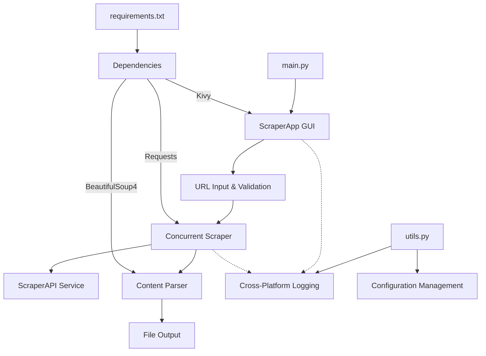
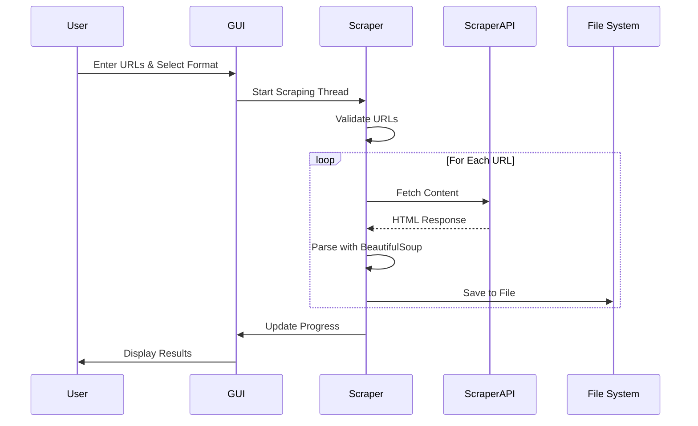

# Web Scraper Pro

A cross-platform web scraping application with GUI interface for extracting and saving web content in multiple formats.

[](LICENSE)
[](https://python.org)

## Quick Reference

- **Cross-Platform GUI** - Runs on Windows, macOS, Linux, and Android [[EVID: ui.py:17-32 | platform detection logic]]
- **Concurrent Scraping** - Multi-threaded URL processing with configurable workers [[EVID: scraper.py:168-203 | ThreadPoolExecutor implementation]]
- **Multiple Output Formats** - Save as TXT or Markdown files [[EVID: ui.py:133-150 | format selection UI]]
- **Robust Error Handling** - Retry logic with exponential backoff [[EVID: scraper.py:28-35 | retry configuration]]
- **ScraperAPI Integration** - Professional web scraping service support [[EVID: scraper.py:19-22 | API integration]]
- **Comprehensive Logging** - Cross-platform logging with rotation [[EVID: utils.py:76-135 | logging configuration]]
- **URL Validation** - Input validation and sanitization [[EVID: scraper.py:41-54 | validate_url function]]

**Tech Stack:** Python 3.7+, Kivy 2.0.0, BeautifulSoup4 4.9.3, Requests 2.25.1

## Architecture Overview



The application follows a layered architecture with GUI frontend, concurrent scraping engine, and cross-platform utilities.



This sequence shows the core scraping workflow from user input to file output.

## Installation

### Prerequisites

- Python 3.7 or higher
- ScraperAPI account and API key [[EVID: scraper.py:18-22 | API key requirement]]

### Setup

1. Clone the repository:
   ```bash
   git clone <repository-url>
   cd web-scraper-pro
   ```

2. Create virtual environment:
   ```bash
   python -m venv venv
   source venv/bin/activate  # On Windows: venv\Scripts\activate
   ```

3. Install dependencies:
   ```bash
   pip install -r requirements.txt
   ```

4. Configure environment variables:
   ```bash
   # Create .env file
   echo "SCRAPER_API_KEY=your_api_key_here" > .env
   echo "KIVY_FULLSCREEN=auto" >> .env
   echo "KIVY_WIDTH=800" >> .env
   echo "KIVY_HEIGHT=600" >> .env
   ```

### Verification

Run the application to verify installation:
```bash
python main.py
```

## Usage

### Quick Start

1. **Launch the application:**
   ```bash
   python main.py
   ```

2. **Enter URLs** in the text field (comma or newline separated):
   ```
   https://example.com
   https://news.site.com
   ```

3. **Select output format** (TXT or MD) [[EVID: ui.py:133-150 | format selection]]

4. **Click "Start Scraping"** to begin processing

5. **Monitor progress** in the activity log

### Configuration

| Environment Variable | Description | Default |
|---------------------|-------------|---------|
| `SCRAPER_API_KEY` | ScraperAPI service key (required) | None |
| `KIVY_FULLSCREEN` | Display mode | `auto` |
| `KIVY_WIDTH` | Window width | `800` |
| `KIVY_HEIGHT` | Window height | `600` |
| `SCRAPER_LOG_LEVEL` | Logging level | `INFO` |
| `SCRAPER_LOG_DIR` | Log directory | Platform-specific |

[[EVID: main.py:10-13 | Kivy configuration]] [[EVID: utils.py:76-87 | logging configuration]]

### Output Locations

- **Windows:** `%USERPROFILE%\Documents\ScraperApp\scraped_data`
- **macOS:** `~/Documents/ScraperApp/scraped_data`
- **Linux:** `~/ScraperApp/scraped_data`
- **Android:** `/storage/emulated/0/ScraperApp/scraped_data`

[[EVID: ui.py:17-32 | platform-specific paths]]

## Project Structure

```
web-scraper-pro/
├── main.py              # Application entry point and configuration
├── ui.py                # Kivy GUI interface and user interactions
├── scraper.py           # Core scraping engine with concurrent processing
├── utils.py             # Cross-platform utilities and logging setup
├── requirements.txt     # Python package dependencies
├── LICENSE              # MIT license
└── README.md           # Project documentation
```

## Development Guide

### Development Environment

1. **Install development dependencies:**
   ```bash
   pip install -r requirements.txt
   ```

2. **Run in debug mode:**
   ```bash
   export SCRAPER_LOG_LEVEL=DEBUG
   python main.py
   ```

### Testing

The application includes comprehensive error handling and logging for debugging:

- **GUI testing:** Launch with debug logging enabled [[EVID: utils.py:135-142 | debug setup]]
- **Scraper testing:** Use URL validation functions [[EVID: scraper.py:41-54 | validation]]
- **Platform testing:** Cross-platform path resolution [[EVID: ui.py:17-32 | platform detection]]

### Code Style

- Python code follows standard conventions
- Comprehensive error handling with logging [[EVID: scraper.py:55-77 | error handling]]
- Thread-safe GUI updates using Kivy's mainthread decorator [[EVID: ui.py:209-217 | mainthread usage]]

## Additional Documentation

- **License:** [MIT License](LICENSE)
- **Dependencies:** See [requirements.txt](requirements.txt)

## Troubleshooting

### Common Issues

1. **API Key Error:** Ensure `SCRAPER_API_KEY` environment variable is set [[EVID: scraper.py:18-22 | API key validation]]
2. **Permission Errors:** Check write permissions for output directory [[EVID: utils.py:43-55 | directory creation]]
3. **GUI Display Issues:** Adjust `KIVY_*` environment variables [[EVID: main.py:10-13 | Kivy config]]

### Debug Mode

Enable detailed logging:
```bash
export SCRAPER_LOG_LEVEL=DEBUG
python main.py
```

---

*Generated on 2025-01-16T02:47:23Z*

<details>
<summary>Evidence Appendix</summary>

- [[EVID: ui.py:17-32 | platform detection logic for cross-platform support]]
- [[EVID: scraper.py:168-203 | ThreadPoolExecutor implementation for concurrent scraping]]
- [[EVID: ui.py:133-150 | format selection UI for TXT/MD output]]
- [[EVID: scraper.py:28-35 | retry configuration with exponential backoff]]
- [[EVID: scraper.py:19-22 | ScraperAPI integration and URL construction]]
- [[EVID: utils.py:76-135 | comprehensive logging configuration]]
- [[EVID: scraper.py:41-54 | URL validation function]]
- [[EVID: scraper.py:18-22 | API key requirement and validation]]
- [[EVID: main.py:10-13 | Kivy configuration from environment variables]]
- [[EVID: utils.py:76-87 | logging level configuration]]
- [[EVID: ui.py:209-217 | mainthread decorator for thread-safe GUI updates]]
- [[EVID: scraper.py:55-77 | comprehensive error handling in fetch_url]]
- [[EVID: utils.py:43-55 | directory creation and permission handling]]
- [[EVID: utils.py:135-142 | debug mode setup function]]

</details>
